<div align="center">

<h1>
  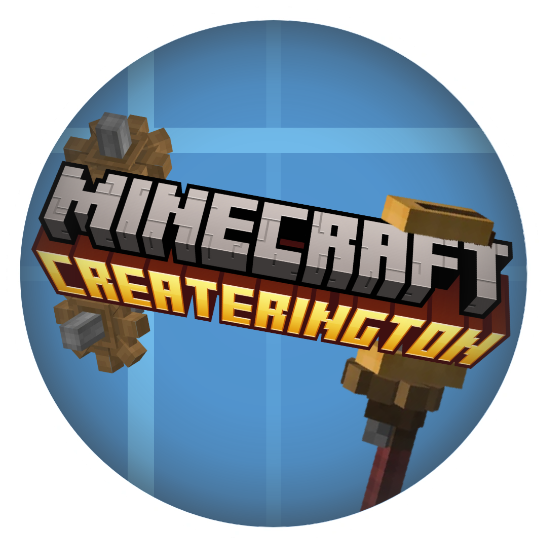
</h1>

<p><b>One portal for a modded Minecraft server, its Discord guild, and its players.</b></p>

<h2>
  <a href="https://createrington.com">createrington.com</a>
</h2>

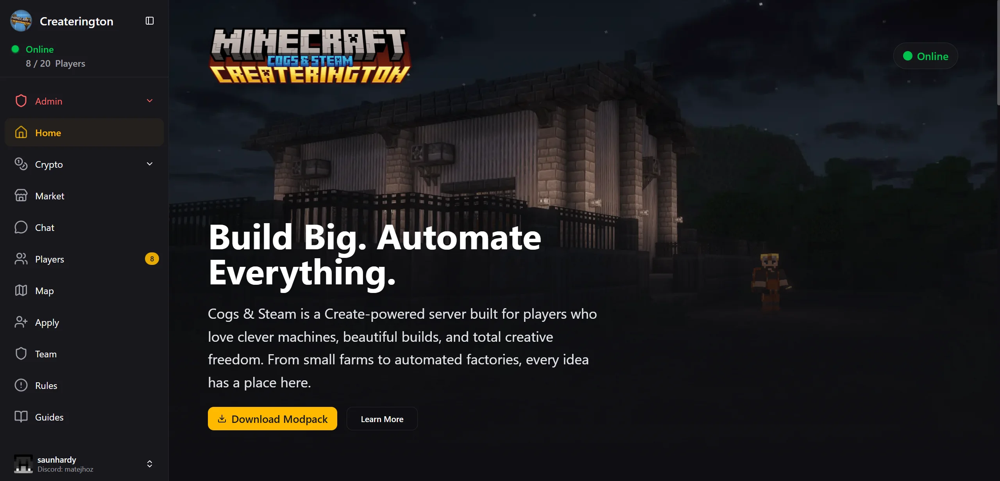

</div>

Createrington is a community platform for a modded Minecraft server. One
TypeScript monorepo ties the game servers, a Discord guild, and a web portal into
a single system: players register once, and their playtime, balance, roles,
achievements, and chat follow them across all three.

## Contents

- [What it does](#what-it-does)
- [Screenshots](#screenshots)
- [How it fits together](#how-it-fits-together)
- [Tech stack](#tech-stack)
- [Quick start](#quick-start)
- [Documentation](#documentation)
- [Related projects](#related-projects)
- [Credits](#credits)
- [License](#license)

## What it does

### Identity and access

Players sign in with Discord OAuth, then link a Minecraft account to unlock the
rest of the portal. New players apply through a waitlist that admins review from
the dashboard; approval triggers a Discord notification and an automatic
whitelist sync to the game server. A cross-subdomain SSO flow lets sibling apps
authenticate against the same session without storing tokens of their own.

### Live presence and chat

Minecraft, Discord, and the web client share one chat stream and one player list.
The game servers push presence over the mod API, the server fans it out over
Socket.io, and Discord webhooks carry it the rest of the way. Session time is
tracked per player and rolled up into hourly, daily, and lifetime totals that
drive playtime-tier Discord roles, leaderboards, and a daily top-player role.

### Simulated crypto market

A fully in-game exchange with three token tiers: volatile memecoins, a €1-pegged
stablecoin, and mean-reverting blue chips. It supports market, limit, stop-loss,
and take-profit orders with partial fills and expiry; broadcasts price ticks over
WebSocket; and serves OHLCV candles at 1m, 5m, 1h, and 1d for TradingView-style
charts. Layered on top are watchlists, price alerts, portfolio snapshots, wealth
and return leaderboards, scheduled market events (crashes, new listings, IPOs),
and AI-written market news that publishes to both the site and Discord.

### Community content

The **workshop** lets players suggest and upvote mods for the next modpack
season, with CurseForge metadata pulled in automatically and a per-player voting
budget. **Structure packs** rotate through a weighted pool that players can see
and influence. **Parties and chunk claims** sync land ownership between the game
and the portal. **Donations** run through Stripe. Achievements, a lottery, and
support tickets round out the player-facing surface.

### Admin dashboard

A full operations panel: player profiles with ban, strike, and balance controls
backed by an audit log; waitlist review; token and market-event management; a
WYSIWYG Discord embed builder with preset categories and linked messages;
scheduled auto-messages; in-game announcements; a FAQ editor; inactivity and
ghost-member cleanup; changelog and modpack tooling; feature flags; and growth,
economy, and moderation analytics.

### Image rendering

Discord slash commands like `/profile`, `/top`, `/activity`, and `/compare`
return rendered cards. Puppeteer drives a headless page for layout and
`@napi-rs/canvas` handles direct composition, both fed by the in-house
Createrington skin API.

## Screenshots

<details>
<summary><b>Web portal</b> (5 images)</summary>

**Crypto market**

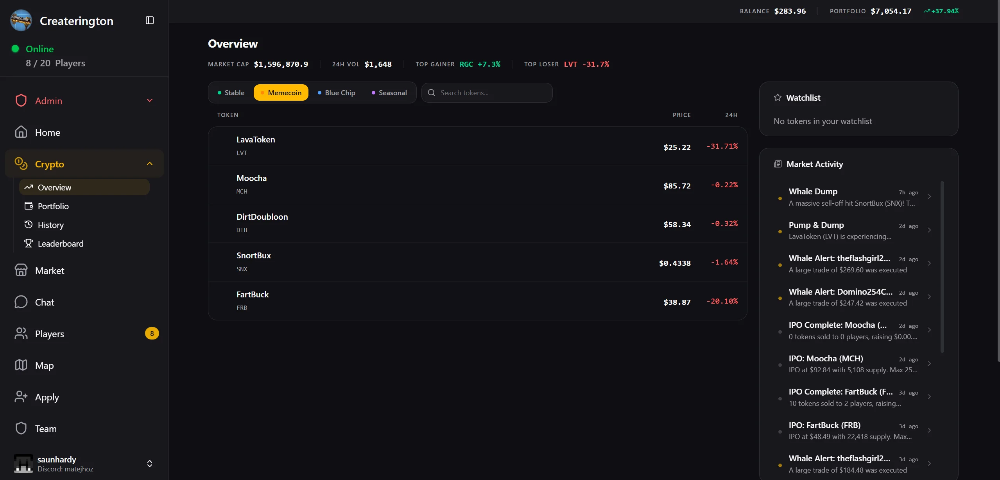

**Token price chart**

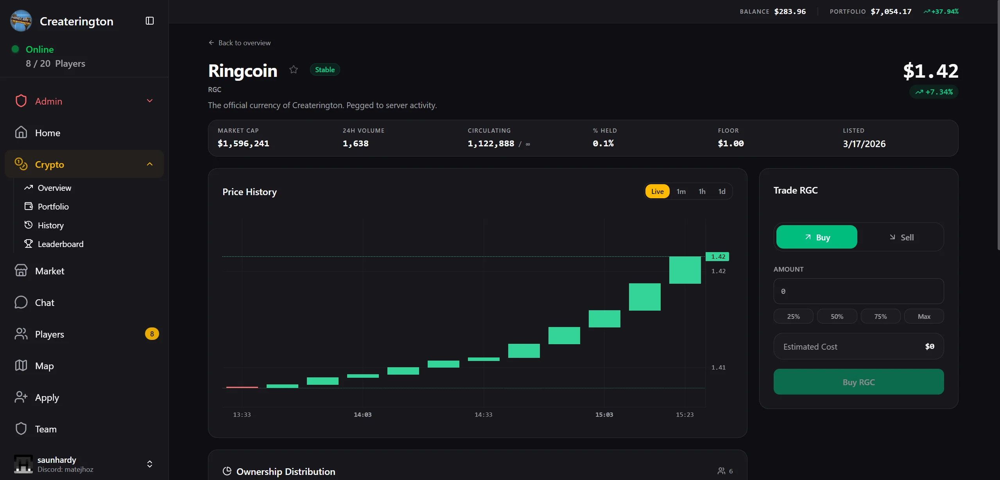

**Portfolio**

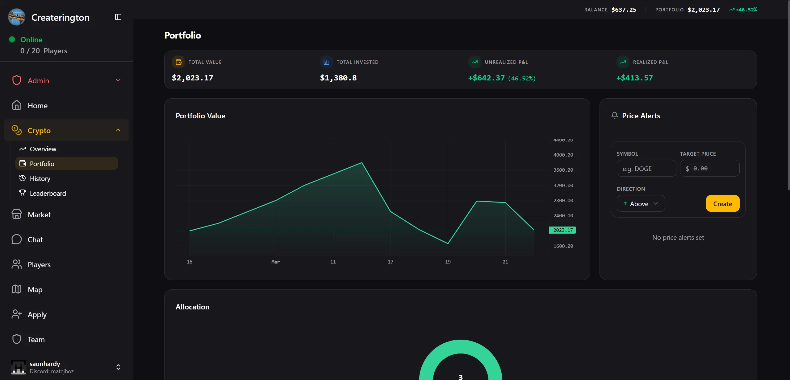

**Live player list**

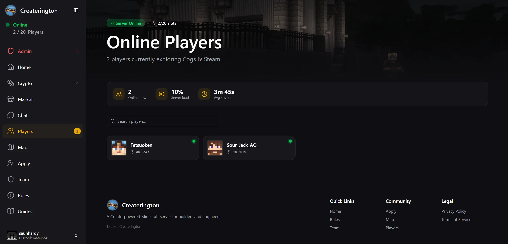

**Chat bridge**

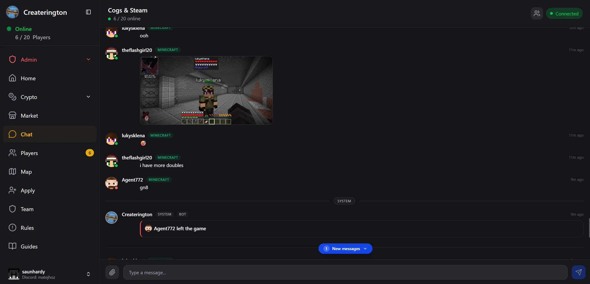

</details>

<details>
<summary><b>Admin dashboard</b> (3 images)</summary>

**Overview**

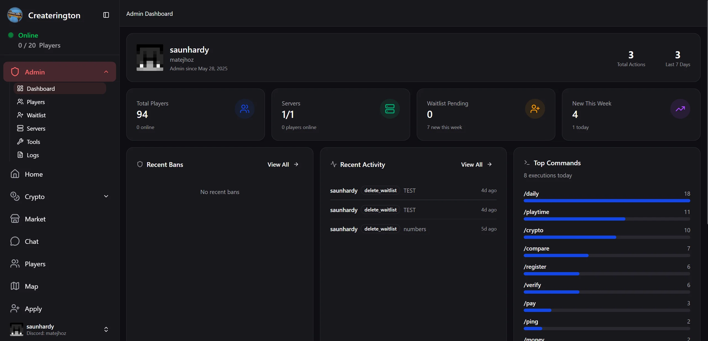

**Player management**

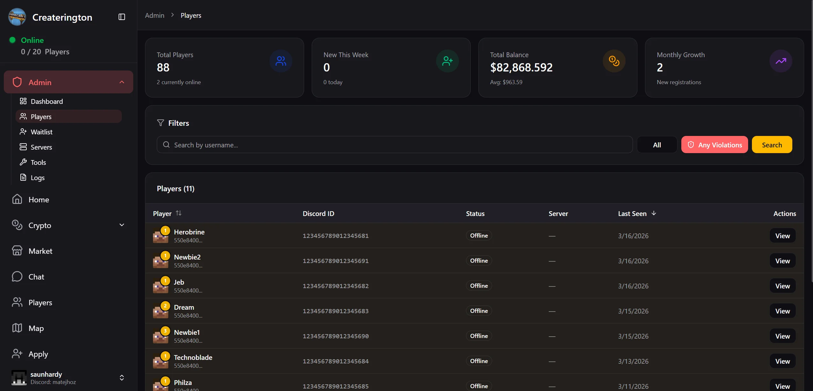

**Token management**

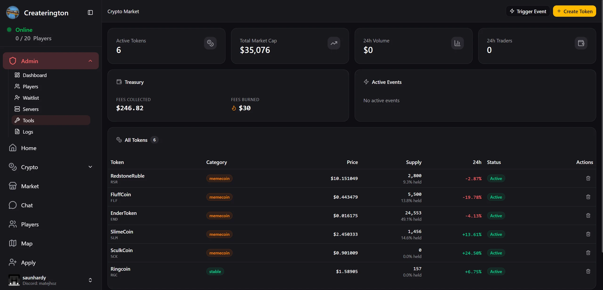

</details>

<details>
<summary><b>Discord render cards</b> (4 images)</summary>

|                                               |                                              |
| --------------------------------------------- | -------------------------------------------- |
| 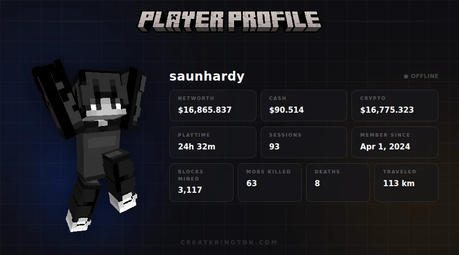  | 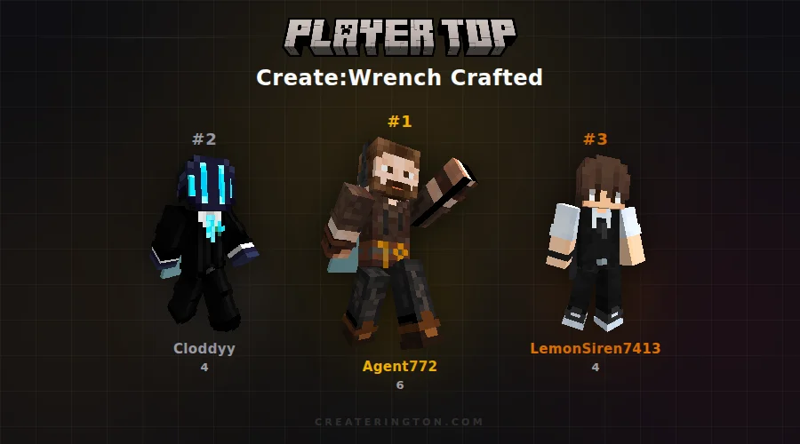         |
| 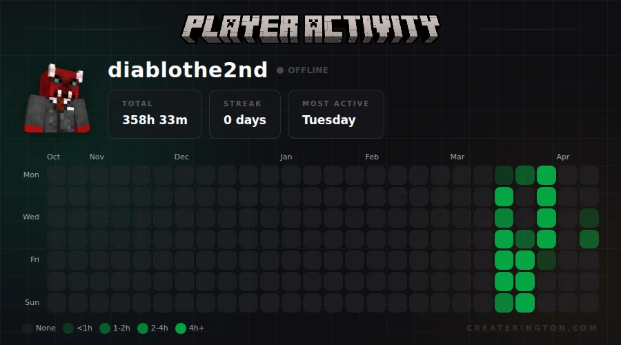 | 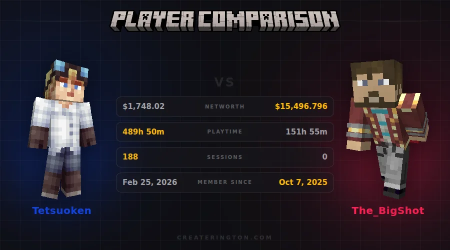 |

</details>

## How it fits together

```
Minecraft servers ──┐
   (NeoForge mods)  │  REST /api/currency, /api/presence, /api/chunks, ...
                    ▼
Discord guild ───► packages/server ◄─── packages/client
  (2 bot users)     Express 5 + tRPC        React 19 + Vite
                    Socket.io               tRPC + React Query
                         │
                         ▼
                   PostgreSQL 15
                    (Drizzle ORM)
```

### Repository layout

| Path                 | What lives there                                             |
| -------------------- | ------------------------------------------------------------ |
| `packages/server`    | Express 5 + tRPC backend, Discord bots, DB layer (port 5001) |
| `packages/client`    | React 19 + Vite single-page app (port 3000)                  |
| `packages/shared`    | Zod schemas, socket contracts, generated DB types            |
| `packages/api-types` | Published tRPC contracts for first-party consumer apps       |
| `mod-api`            | Java records generated from the mod-facing API specs         |
| `docker/db`          | PostgreSQL container, migrations, seed data                  |
| `docker/mc`          | Local NeoForge 1.21.1 server for development                 |
| `marketing`          | Remotion promo video (outside the pnpm workspace)            |
| `screenshots`        | Product shots used by this README and the marketing video    |

### Backend

Express 5 hosts a tRPC v11 API alongside a thin REST layer for webhooks, OAuth,
uploads, and the Minecraft mods. tRPC procedures come in four auth levels
(`public`, `user`, `admin`, `owner`), plus a `consumers` namespace that exposes
per-consumer sub-routers to external first-party apps. Services are wired through
a custom DI container with declared dependencies and parallel startup. Two
Discord bot users split the work: a main bot for slash commands, events, and
leaderboards, and a web bot for OAuth and background tasks.

Data access goes through Drizzle-backed query classes with automatic
camelCase/snake_case conversion. Raw SQL stays in the query layer, and all
business logic lives in application code, so the database has no functions or
triggers.

### Frontend

A React 19 SPA served by Vite, with tRPC + React Query for data, Socket.io for
live updates, and `ky` for the REST endpoints. Styling is Tailwind CSS v4 on an
OkLCH dark palette, with Shadcn/ui components over Radix primitives.

### End-to-end types

The server exports its router type, and the client imports it type-only. There is
no generated client and no runtime cost, so an API change surfaces as a
compile error on the other side.

```typescript
import type { AppRouter } from "@createrington/server/trpc";
```

## Tech stack

| Layer     | Technology                                                |
| --------- | --------------------------------------------------------- |
| Runtime   | Node.js 22, pnpm workspaces, TypeScript 5                 |
| Backend   | Express 5, tRPC v11                                       |
| Frontend  | React 19, Vite 7, Tailwind CSS v4, Shadcn/ui, Radix UI    |
| Database  | PostgreSQL 15, Drizzle ORM                                |
| Real-time | Socket.io                                                 |
| Auth      | Discord OAuth, JWT access token + httpOnly refresh cookie |
| Discord   | Discord.js v14 (two bot instances)                        |
| Minecraft | RCON, SFTP, NeoForge 1.21.1 mod API                       |
| Charts    | lightweight-charts, Recharts                              |
| Payments  | Stripe                                                    |
| Email     | Resend                                                    |
| AI        | OpenAI (market news, admin tooling)                       |
| Rendering | puppeteer-core, @napi-rs/canvas, skinview3d               |
| Maps      | BlueMap                                                   |
| Testing   | Vitest                                                    |

## Quick start

Requires Node.js 22+, pnpm, and Docker.

```bash
git clone https://gitea.matejhoz.com/Createrington/app.git createrington
cd createrington
pnpm install
cp .env.example .env      # then fill in section 1
pnpm db:up                # PostgreSQL on port 5433
pnpm db:migrate
pnpm db:seed
pnpm generate             # DB types + query classes
pnpm dev                  # server :5001, client :3000, type watcher
```

`.env.example` is the authoritative reference for configuration. Filling in
section 1 is enough to boot locally; sections 2 and 3 cover production-only
values and optional integrations, each of which self-disables when unset.

To exercise the Discord side, snapshot the guild's roles, channels, and
categories, then register the slash commands:

```bash
pnpm scrape-discord       # writes discord-entities.json
pnpm deploy-commands
```

The server still boots without that snapshot, but Discord-dependent features
will not resolve their targets.

A local NeoForge server is available for anything that needs a real game server:

```bash
pnpm mc:up                # start the server and attach to its console
```

See [`docker/mc/README.md`](docker/mc/README.md) for details.

## Documentation

| Document                                                     | Covers                                                  |
| ------------------------------------------------------------ | ------------------------------------------------------- |
| [CONTRIBUTING.md](CONTRIBUTING.md)                           | Setup, conventions, database workflow, commits, PRs, CI |
| [.env.example](.env.example)                                 | Every environment variable, annotated                   |
| [mod-api/README.md](mod-api/README.md)                       | The Java API library and its release flow               |
| [docker/mc/README.md](docker/mc/README.md)                   | Local Minecraft server                                  |
| [marketing/README.md](marketing/README.md)                   | Remotion promo video                                    |
| [packages/api-types/README.md](packages/api-types/README.md) | Consuming the tRPC contracts from another app           |

## Related projects

- [**Createrington Currency**](https://github.com/matejhozlar/createrington-currency)
  is the Minecraft mod that exposes in-game currency to this platform.
- [**Cogs & Steam**](https://www.curseforge.com/minecraft/modpacks/createrington-cogs-steam)
  is the official modpack.
- [**mc-page**](https://github.com/matejhozlar/mc-page) is the predecessor: a
  single-package Node.js and React portal, rewritten into this monorepo.

## Credits

Full-body skin renders come from the in-house Createrington skin API. A couple of
free public Minecraft skin APIs cover the rest:

- [MCHeads](https://mc-heads.net/), for avatar thumbnails and as the fallback
  body renderer.
- [Crafatar](https://crafatar.com/), for server-side skin downloads.

Thanks to each of them for keeping their APIs open to the community.

## License

Proprietary. All rights reserved by Matej Hozlar; see [LICENSE](LICENSE).

Not affiliated with Mojang, Microsoft, or Discord. The in-game cryptocurrency
market is a simulated economy for entertainment only and has no real-world
monetary value.
