<div align="center">

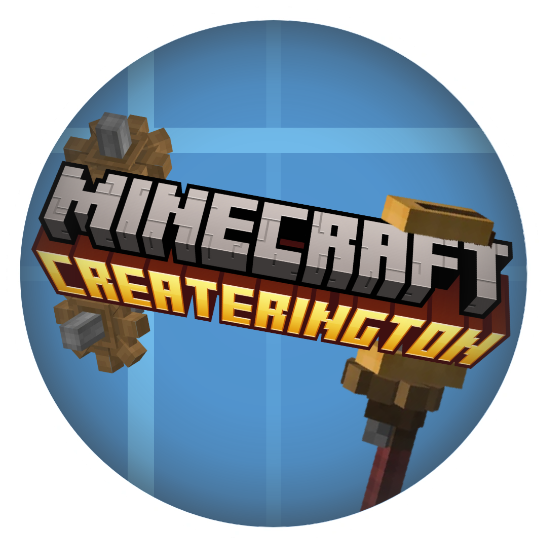

<h1>Createrington</h1>

One portal for a modded Minecraft server, its Discord guild, and its players. A single TypeScript monorepo ties the game servers, the Discord bots, and the web app together, so a player registers once and their playtime, balance, roles, and chat follow them everywhere.

### [**Visit createrington.com**](https://createrington.com)

[](https://createrington.com)
[](https://www.curseforge.com/minecraft/modpacks/createrington-rails-n-sails)


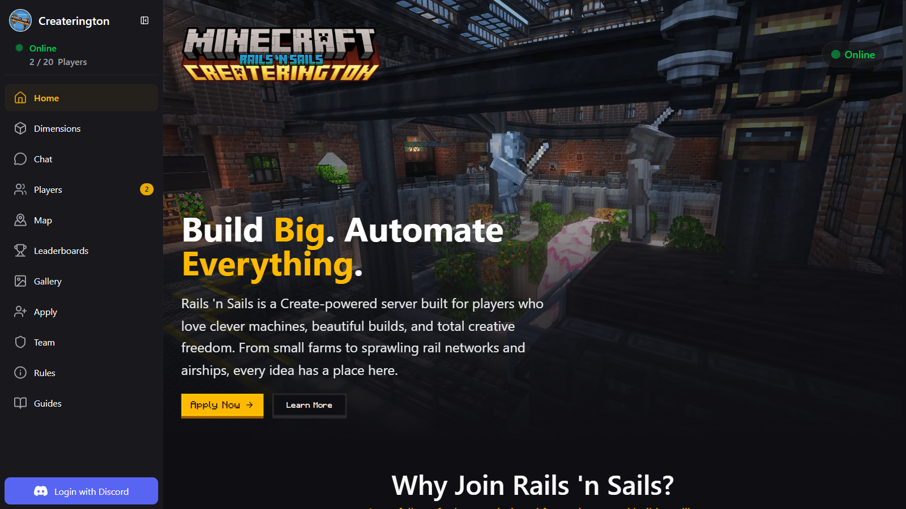

</div>

---

## Contents

- [The portal](#the-portal)
- [Leaderboards](#leaderboards)
- [Live from the server](#live-from-the-server)
- [Community](#community)
- [Admin dashboard](#admin-dashboard)
- [Discord render cards](#discord-render-cards)
- [How it fits together](#how-it-fits-together)
- [Tech stack](#tech-stack)
- [Quick start](#quick-start)
- [Documentation](#documentation)
- [Related projects](#related-projects)
- [Credits](#credits)
- [License](#license)

---

## The portal

<table>
<tr>
<td width="50%">
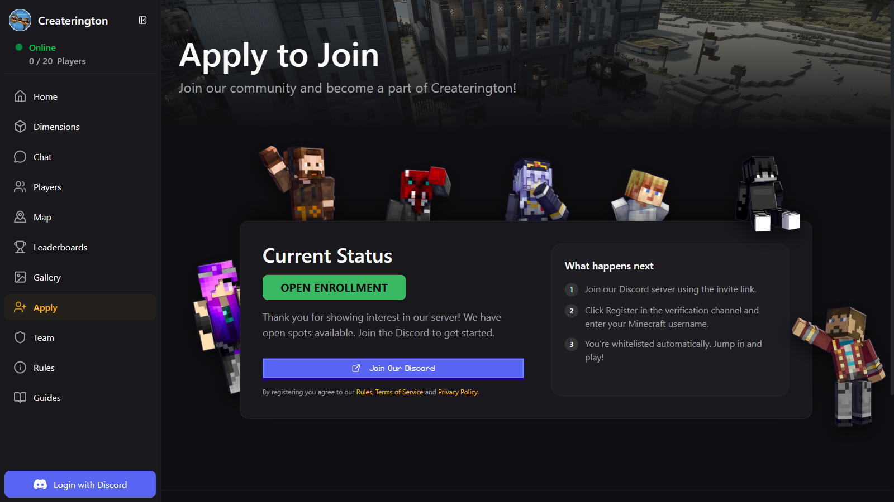
</td>
<td width="50%" valign="middle">
<h3>Apply in three steps</h3>
The apply page shows the live enrollment status and walks a new player through the whole flow: join the Discord, register a Minecraft username in the verification channel, and get whitelisted on the game server automatically. The team's skins lean in around the card to say hello.
</td>
</tr>

<tr>
<td width="50%" valign="middle">
<h3>Guides that stay current</h3>
Step-by-step guides cover installing and updating the modpack, with annotated screenshots and a reading time on every card. They live in the portal, so they ship with the same release as the features they describe.
</td>
<td width="50%">
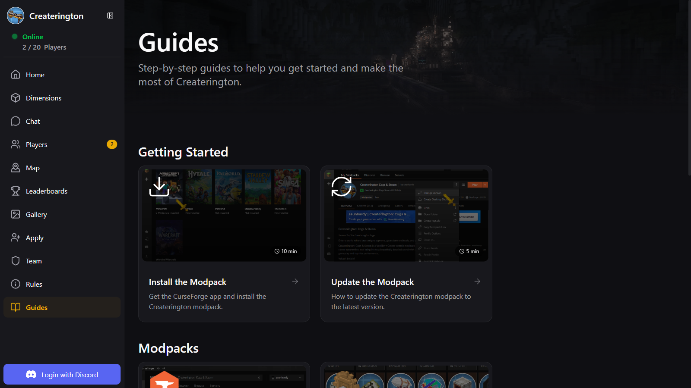
</td>
</tr>

<tr>
<td width="50%">
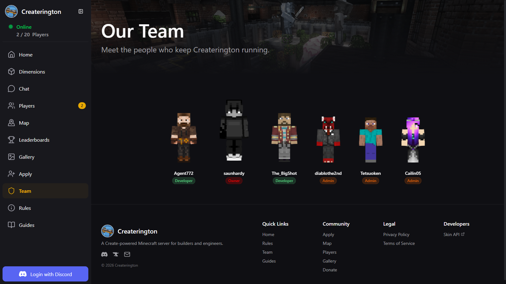
</td>
<td width="50%" valign="middle">
<h3>Meet the team</h3>
The owner, developers, and admins who keep the server running, each rendered as a full-body skin by the in-house Createrington skin API and tagged with their role.
</td>
</tr>
</table>

---

## Leaderboards

<table>
<tr>
<td width="55%">
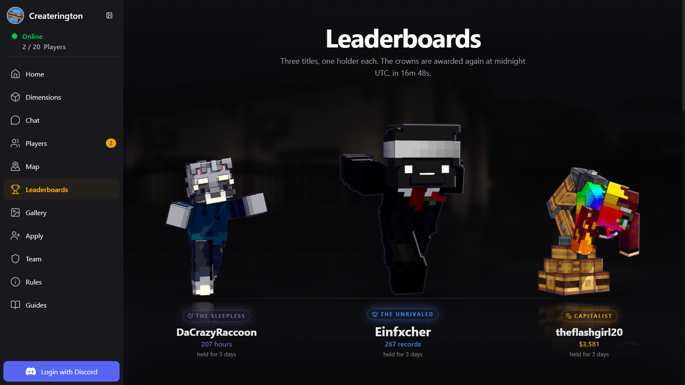
</td>
<td width="45%" valign="middle">
<h3>Three titles, one holder each</h3>
<b>The Sleepless</b> goes to the most playtime, <b>The Unrivaled</b> to the most #1 records, and <b>Capitalist</b> to the biggest balance. The crowns are awarded again every midnight UTC, and each one is mirrored to a Discord role and an in-game rank.
</td>
</tr>

<tr>
<td width="45%" valign="middle">
<h3>Every player, ranked</h3>
Thousands of Minecraft stats are contested at once. Switch between playtime, wealth, and records, search for a player, or open a row to see exactly which stats they hold the top spot in.
</td>
<td width="55%">
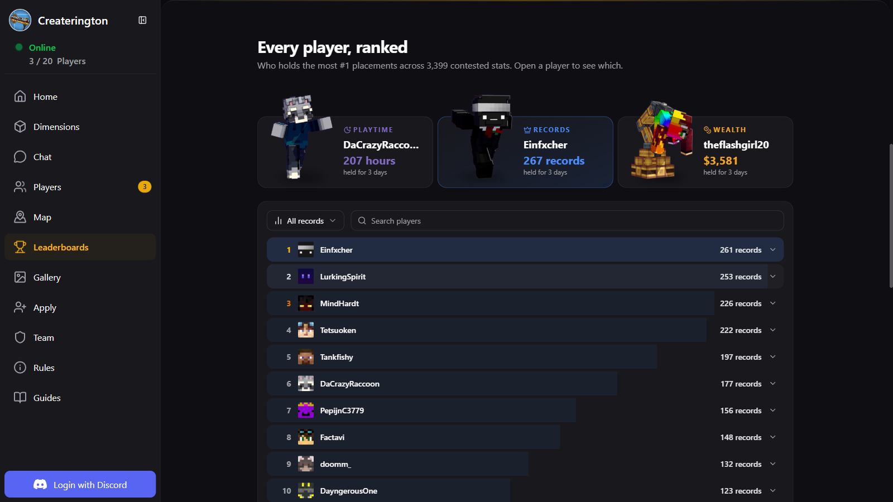
</td>
</tr>

<tr>
<td width="55%">
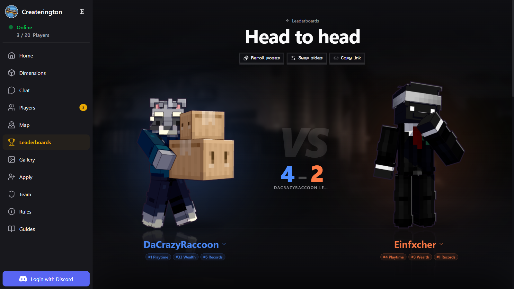
</td>
<td width="45%" valign="middle">
<h3>Head to head</h3>
Pick any two players and the portal scores them against each other across every board. Reroll the poses, swap sides, and copy a link that unfurls into a live social card of the matchup.
</td>
</tr>
</table>

---

## Live from the server

<table>
<tr>
<td width="50%">
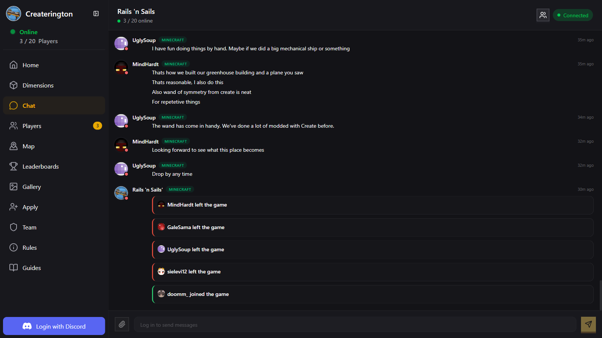
</td>
<td width="50%" valign="middle">
<h3>One chat, three places</h3>
Minecraft, Discord, and the web client share a single chat stream. Messages, joins, and leaves arrive over Socket.io the moment they happen, tagged with where they came from.
</td>
</tr>

<tr>
<td width="50%" valign="middle">
<h3>Who is online</h3>
The game servers push presence through the mod API, so the player list, slot count, server load, and session timers are always live. Session time rolls up into hourly, daily, and lifetime totals that drive the playtime roles.
</td>
<td width="50%">
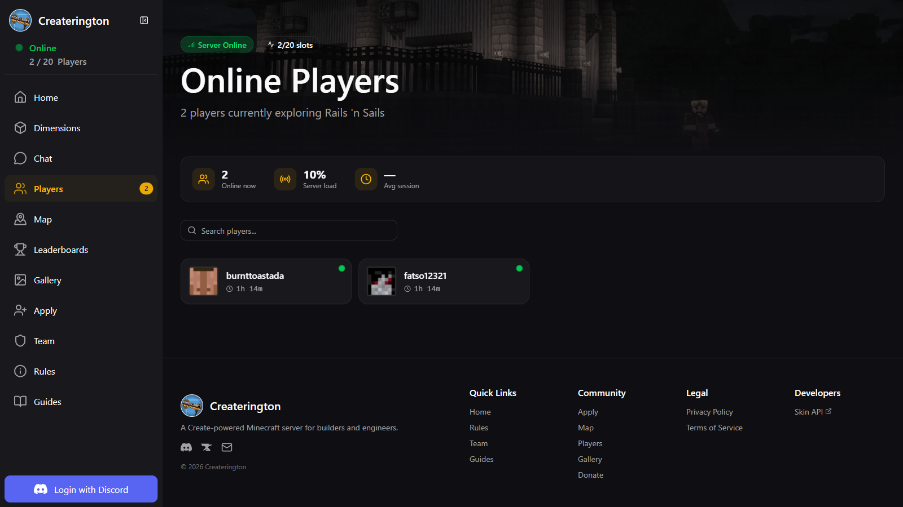
</td>
</tr>

<tr>
<td width="50%">
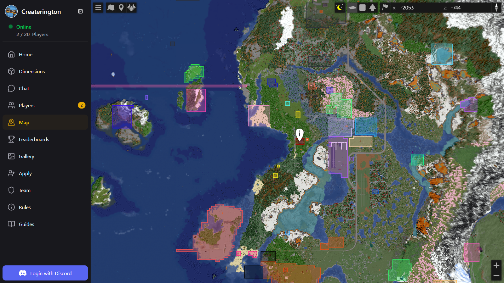
</td>
<td width="50%" valign="middle">
<h3>The world, mapped</h3>
An embedded BlueMap shows the whole world in the browser, with claimed land outlined on top so everyone can see who has settled where.
</td>
</tr>
</table>

---

## Community

<table>
<tr>
<td width="55%">
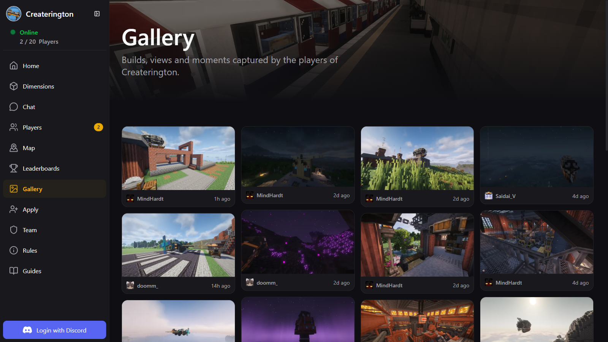
</td>
<td width="45%" valign="middle">
<h3>Gallery</h3>
Players post screenshots in Discord, admins review them, and the best builds, views, and moments are published to the gallery with the author's skin and name attached.
</td>
</tr>

<tr>
<td width="45%" valign="middle">
<h3>Shape the next world</h3>
Mining dimensions rotate on a schedule. Players spend in-game currency to boost the themed dimension they want next, and weighted voting decides what appears through the portal.
</td>
<td width="55%">
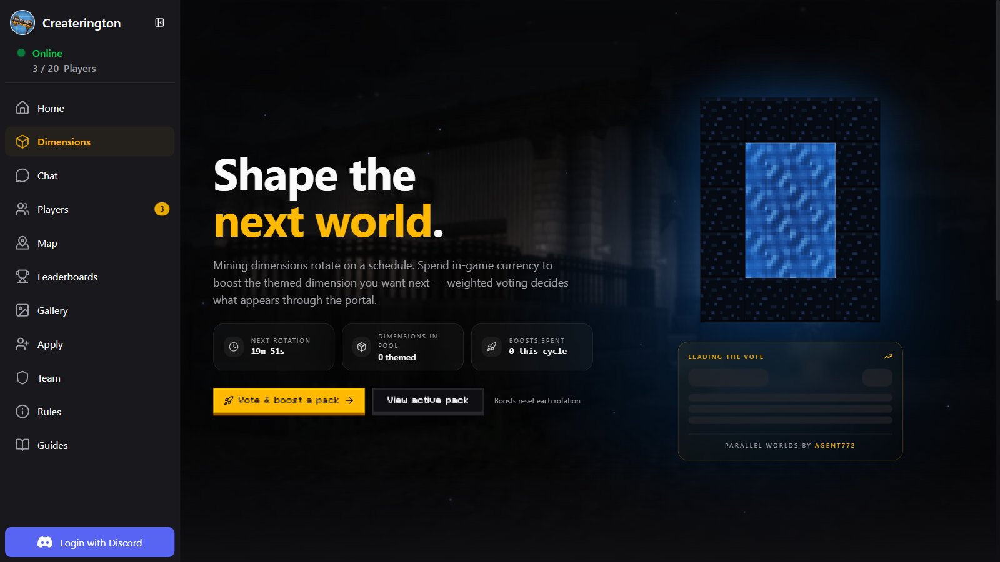
</td>
</tr>
</table>

Signed-in players get more on top of that:

- **Workshop** - suggest and upvote mods for the next modpack season, with CurseForge metadata pulled in automatically and a per-player voting budget.
- **Parties and chunk claims** - land ownership syncs between the game and the portal.
- **Donations** - handled through Stripe.
- **Single sign-on** - sign in with Discord once, and sibling apps authenticate against the same session without storing tokens of their own.

---

## Admin dashboard

<table>
<tr>
<td width="50%">
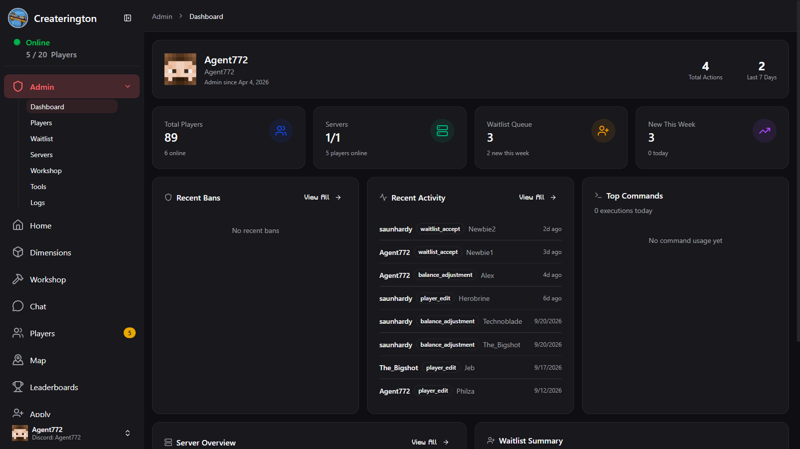
</td>
<td width="50%" valign="middle">
<h3>Everything at a glance</h3>
Player counts, server status, the waitlist queue, recent bans, and an audit trail of every admin action sit on one screen, next to the Discord commands players are running most.
</td>
</tr>

<tr>
<td width="50%" valign="middle">
<h3>A workbench of tools</h3>
Auto messages, the FAQ auto-responder, player prompts, structure packs, workshop review, parties, gallery moderation, and inactivity cleanup are grouped by category, searchable, and pinnable.
</td>
<td width="50%">
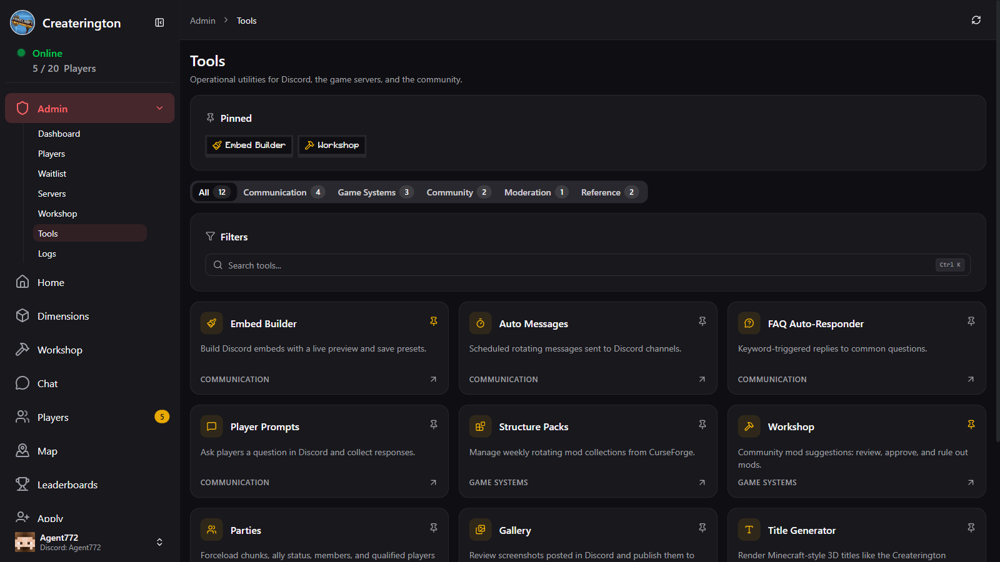
</td>
</tr>

<tr>
<td width="50%">
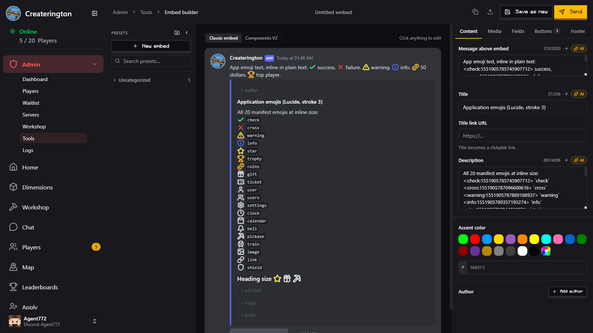
</td>
<td width="50%" valign="middle">
<h3>Embed builder</h3>
A WYSIWYG editor for Discord messages, covering both classic embeds and Components V2. Click anything in the live preview to edit it, save presets into categories, and send straight to a channel.
</td>
</tr>

<tr>
<td width="50%" valign="middle">
<h3>Title generator</h3>
Builds Minecraft-style 3D titles like the Createrington wordmark, with per-line fonts, textures, overlays, and styling, then exports a transparent PNG.
</td>
<td width="50%">
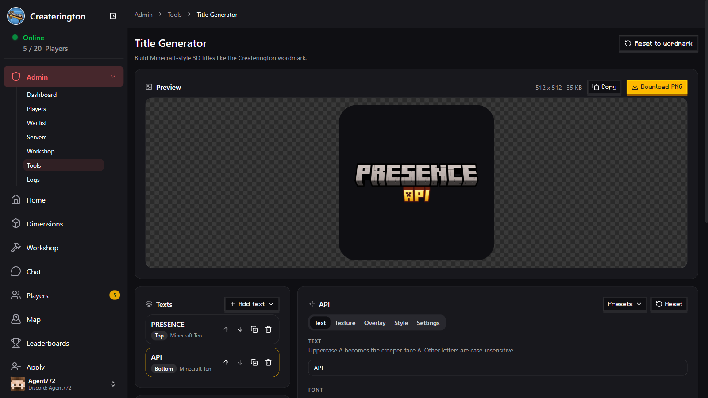
</td>
</tr>
</table>

Player profiles round it out, with ban, strike, and balance controls, plus waitlist review, in-game announcements, changelog and modpack tooling, feature flags, and server logs.

---

## Discord render cards

Slash commands like `/profile`, `/top`, `/activity`, `/compare`, and `/records` answer with rendered cards. Puppeteer drives a headless page for layout and `@napi-rs/canvas` handles direct composition, both fed by the Createrington skin API.

<table>
<tr>
<td width="33%" align="center">
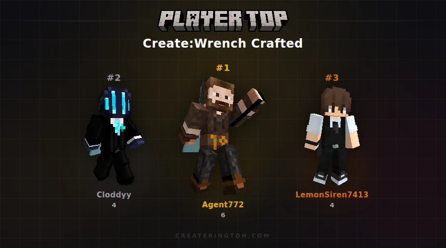
<br><sub><b>/top</b></sub>
</td>
<td width="33%" align="center">
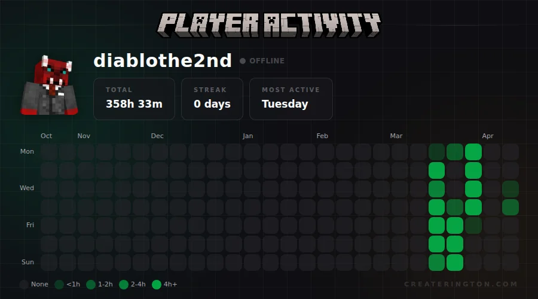
<br><sub><b>/activity</b></sub>
</td>
<td width="33%" align="center">
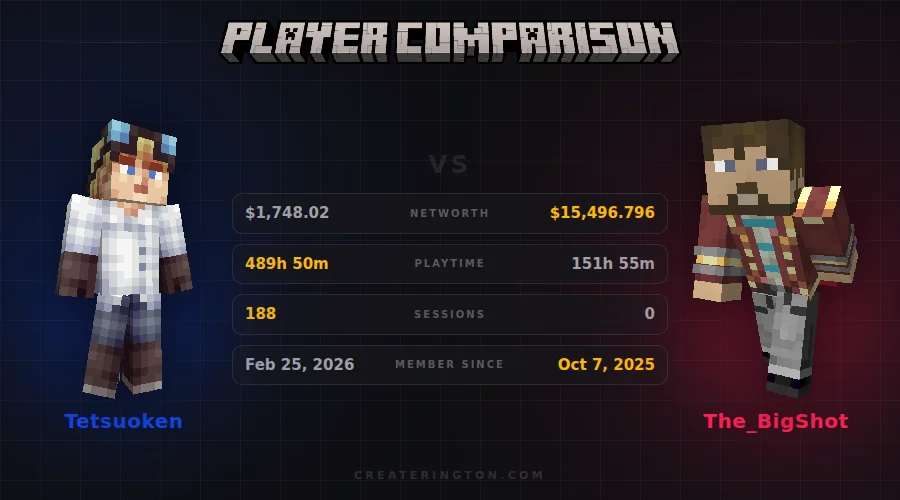
<br><sub><b>/compare</b></sub>
</td>
</tr>
</table>

---

## How it fits together

```
Minecraft servers ──┐
   (NeoForge mods)  │  REST /api/currency, /api/presence, /api/chunks, ...
                    ▼
Discord guild ───► packages/server ◄─── packages/client
  (2 bot users)     Express 5 + tRPC        React 19 + Vite
                    Socket.io               tRPC + React Query
                         │
                         ▼
                   PostgreSQL 15
                    (Drizzle ORM)
```

### Repository layout

| Path                 | What lives there                                             |
| -------------------- | ------------------------------------------------------------ |
| `packages/server`    | Express 5 + tRPC backend, Discord bots, DB layer (port 5001) |
| `packages/client`    | React 19 + Vite single-page app (port 3000)                  |
| `packages/shared`    | Zod schemas, socket contracts, generated DB types            |
| `packages/api-types` | Published tRPC contracts for first-party consumer apps       |
| `mod-api`            | Java records generated from the mod-facing API specs         |
| `docker/db`          | PostgreSQL container, migrations, seed data                  |
| `docker/mc`          | Local NeoForge 1.21.1 server for development                 |
| `screenshots`        | Product shots used by this README and the OG card renders    |

### Backend

Express 5 hosts a tRPC v11 API alongside a thin REST layer for webhooks, OAuth,
uploads, and the Minecraft mods. tRPC procedures come in four auth levels
(`public`, `user`, `admin`, `owner`), plus a `consumers` namespace that exposes
per-consumer sub-routers to external first-party apps. Services are wired through
a custom DI container with declared dependencies and parallel startup. Two
Discord bot users split the work: a main bot for slash commands, events,
leaderboards, and user login (Discord OAuth runs on its application), and a web
bot for admin-panel messaging and background tasks.

Data access goes through Drizzle-backed query classes with automatic
camelCase/snake_case conversion. Raw SQL stays in the query layer, and all
business logic lives in application code, so the database has no functions or
triggers.

### Frontend

A React 19 SPA served by Vite, with tRPC + React Query for data, Socket.io for
live updates, and `ky` for the REST endpoints. Styling is Tailwind CSS v4 on an
OkLCH dark palette, with Shadcn/ui components over Radix primitives.

### End-to-end types

The server exports its router type, and the client imports it type-only. There is
no generated client and no runtime cost, so an API change surfaces as a
compile error on the other side.

```typescript
import type { AppRouter } from "@createrington/server/trpc";
```

---

## Tech stack

| Layer     | Technology                                                |
| --------- | --------------------------------------------------------- |
| Runtime   | Node.js 22, pnpm workspaces, TypeScript 5                 |
| Backend   | Express 5, tRPC v11                                       |
| Frontend  | React 19, Vite 7, Tailwind CSS v4, Shadcn/ui, Radix UI    |
| Database  | PostgreSQL 15, Drizzle ORM                                |
| Cache     | Redis 8 (optional, falls back to process memory)          |
| Real-time | Socket.io                                                 |
| Auth      | Discord OAuth, JWT access token + httpOnly refresh cookie |
| Discord   | Discord.js v14 (two bot instances)                        |
| Minecraft | RCON, SFTP, NeoForge 1.21.1 mod API                       |
| Charts    | lightweight-charts, Recharts                              |
| Payments  | Stripe                                                    |
| Email     | Resend                                                    |
| AI        | OpenAI (admin tooling)                                    |
| Rendering | puppeteer-core, @napi-rs/canvas, skinview3d               |
| Maps      | BlueMap                                                   |
| Testing   | Vitest                                                    |

---

## Quick start

Requires Node.js 22+, pnpm, and Docker.

```bash
git clone https://gitea.matejhoz.com/Createrington/app.git createrington
cd createrington
pnpm install
cp .env.example .env      # then fill in section 1
pnpm db:up                # PostgreSQL on port 5433, Redis on port 6380
pnpm db:migrate
pnpm db:seed
pnpm generate             # DB types + query classes
pnpm dev                  # server :5001, client :3000, type watcher
```

`.env.example` is the authoritative reference for configuration. Filling in
section 1 is enough to boot locally; sections 2 and 3 cover production-only
values and optional integrations, each of which self-disables when unset.

To exercise the Discord side, snapshot the guild's roles, channels, and
categories, then register the slash commands:

```bash
pnpm scrape-discord       # writes discord-entities.json
pnpm deploy-commands
```

The server still boots without that snapshot, but Discord-dependent features
will not resolve their targets.

A local NeoForge server is available for anything that needs a real game server:

```bash
pnpm mc:up                # start the server and attach to its console
```

See [`docker/mc/README.md`](docker/mc/README.md) for details.

---

## Documentation

| Document                                                     | Covers                                                  |
| ------------------------------------------------------------ | ------------------------------------------------------- |
| [CONTRIBUTING.md](CONTRIBUTING.md)                           | Setup, conventions, database workflow, commits, PRs, CI |
| [.env.example](.env.example)                                 | Every environment variable, annotated                   |
| [mod-api/README.md](mod-api/README.md)                       | The Java API library and its release flow               |
| [docker/mc/README.md](docker/mc/README.md)                   | Local Minecraft server                                  |
| [packages/api-types/README.md](packages/api-types/README.md) | Consuming the tRPC contracts from another app           |

---

## Related projects

- [**Createrington Currency**](https://github.com/matejhozlar/createrington-currency)
  is the Minecraft mod that exposes in-game currency to this platform.
- [**Rails 'n Sails**](https://www.curseforge.com/minecraft/modpacks/createrington-rails-n-sails)
  is the official modpack.
- [**mc-page**](https://github.com/matejhozlar/mc-page) is the predecessor: a
  single-package Node.js and React portal, rewritten into this monorepo.

---

## Credits

Full-body skin renders come from the in-house Createrington skin API. A couple of
free public Minecraft skin APIs cover the rest:

- [MCHeads](https://mc-heads.net/), for avatar thumbnails and as the fallback
  body renderer.
- [Crafatar](https://crafatar.com/), for server-side skin downloads.

Thanks to each of them for keeping their APIs open to the community.

---

## License

Proprietary. All rights reserved by Matej Hozlar; see [LICENSE](LICENSE).

Not affiliated with Mojang, Microsoft, or Discord. The in-game economy is
simulated for entertainment only and has no real-world monetary value.
